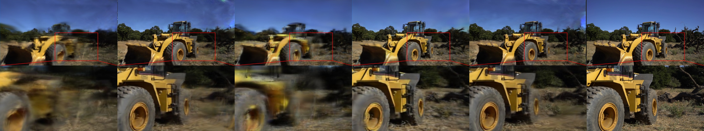

# Worse-Pose-but-Better-3DGS

<!-- ## [[Project]](https://wla-98.github.io/worse-pose-but-better-3DGS/) |  [[Arxiv]](https://wla-98.github.io/worse-pose-but-better-3DGS/) -->

## Project Overview
1. It aims to replace the COLMAP initialization process used in traditional 3DGS. By leveraging efficient algorithms and technical architectures, it significantly reduces the time cost from the startup to the completion of the 3DGS system construction, enabling the rapid acquisition of the final dense map. During this process, it makes full use of the technical advantages of ORB - SLAM to accurately capture input image information and obtain accurate camera poses, laying a solid foundation for the subsequent reconstruction steps and making the entire 3D construction process more smooth and efficient.

2. It focuses on optimizing the camera pose stage. By introducing cutting - edge optimization algorithms and intelligent strategies, it conducts iterative adjustments on the initial camera poses. Through continuous comparison between the reconstructed model and the original image data, it precisely corrects pose deviations, thus obtaining higher - quality 3DGS reconstruction results. This ensures that the final generated 3D geometric structures reach a higher standard in terms of detail reproduction and spatial accuracy, meeting diverse application requirements.


## Results





## Installation Instructions
To set up the environment for this project, you need to install several components. Here are the links and brief descriptions for each of them:

### Windows 11 with WSL2
- **Link**: [https://learn.microsoft.com/en-us/windows/wsl/install](https://learn.microsoft.com/en-us/windows/wsl/install)
- **Description**: Windows Subsystem for Linux 2 (WSL2) allows you to run a Linux environment natively on your Windows 11 system. Follow the official Microsoft documentation provided in the link to install and configure WSL2 properly. This step is crucial as our project relies on a Linux-based environment for many of its operations.

### Anaconda
- **Link**: [https://docs.anaconda.com/anaconda/install/](https://docs.anaconda.com/anaconda/install/)
- **Description**: Anaconda is a popular platform for managing Python environments and packages. It is recommended to follow the installation guide on the provided link to install Anaconda on your system. Additionally, for this project, it is advisable to create an Anaconda environment based on the `environment.yaml` file in the MONOGS project (https://github.com/muskie82/MonoGS) to manage the necessary Python libraries efficiently and ensure compatibility with other components of our project.

### ROS-noetic
- **Link**: [https://wiki.ros.org/noetic#Installation](https://wiki.ros.org/noetic#Installation)
- **Description**: The Robot Operating System (ROS) in its noetic version is an essential part of our project for handling robotic-related tasks, such as sensor data processing, robot control, and more. Refer to the ROS wiki link for detailed installation instructions to get ROS-noetic up and running on your system. Note that ROS-noetic comes with libraries like OpenCV 4.2.0, PCL, Boost, etc., which are utilized within our project's framework.

### ORBSLAM3
- **Link**: [https://github.com/UZ-SLAMLab/ORB_SLAM3](https://github.com/UZ-SLAMLab/ORB_SLAM3)
- **Description**: ORB_SLAM3 is a state-of-the-art Simultaneous Localization and Mapping (SLAM) library. It plays a significant role in our project for tasks like mapping the environment and localizing within it. Visit the GitHub page to learn about its installation process, which may involve cloning the repository, installing dependencies, and compiling the code.

### CUDA 11.8
- **Link**: [https://developer.nvidia.com/cuda-11-8-0-download-archive?target_os=Linux&target_arch=x86_64&Distribution=WSL-Ubuntu&target_version=2.0&target_type=deb_local](https://developer.nvidia.com/cuda-11-8-0-download-archive?target_os=Linux&target_arch=x86_64&Distribution=WSL-Ubuntu&target_version=2.0&target_type=deb_local)
- **Description**: CUDA 11.8 is required for leveraging the GPU computing capabilities in our project. Follow the instructions on the provided NVIDIA developer website to download and install CUDA 11.8 on your WSL2 (Ubuntu 20.04) environment. Make sure to select the appropriate options based on your system configuration (targeting Linux, x86_64 architecture, WSL-Ubuntu distribution, version 2.0, and deb_local as the target type).

### MONOGS
- **Link**: [https://github.com/muskie82/MonoGS](https://github.com/muskie82/MonoGS)
- **Description**: The MONOGS project implements a dense SLAM system based on 3D Gaussian Splatting, which won the highlight and best demo award at CVPR 2024. It for the first time demonstrates a monocular SLAM method solely relying on 3D Gaussian Splatting, mainly utilizing the gradient propagation with camera poses.

**Recommendation**: 
The project has been developed and tested in a specific environment setup. We are using **Windows 11 with WSL2 running Ubuntu 20.04** as the base Linux environment. **ROS-noetic** is an integral part of our system, which conveniently provides useful libraries such as **OpenCV 4.2.0**, **PCL 1.10**, and Boost out-of-the-box. **Eigen 3.1.0** is another key library utilized in our project. For efficient management of Python libraries and to ensure compatibility with other components, we recommend creating an Anaconda environment following the **`environment.yaml`** file in the MONOGS project. Also, **CUDA-TOOLKIT 11.8** is essential for taking advantage of GPU acceleration in relevant parts of our project. Sticking to these specific environment and library versions can help minimize potential compatibility issues and ensure the smooth running of the project. However, if you do decide to use different versions, be aware that you may encounter difficulties and might need to perform additional configuration and debugging to make the project work as expected.

<!-- insert the example video in this directory experiment-example.mp4-->

## click the image to see the experiment video
[](https://youtu.be/erVag7vNiF4)

## Usage
### ORB-SLAM INITIALIZATION
1. **Create a ROS Workspace**:
    - Open your terminal in the WSL2 (Ubuntu 20.04) environment.
    - Create a new directory for your ROS workspace (you can choose any name you prefer, here we'll use `my_ros_ws` as an example). Run the following command:
        ```bash
        mkdir -p "my_ros_ws"/src
        cd "my_ros_ws"
        catkin init
2. **Clone the Project**:
    - Navigate into the `src` folder within the newly created ROS workspace:
        ```bash
        cd “my_ros_ws”/src
    - Then, clone the `Worse-Pose-but-Better-3DGS` project repository using the following `git` command:
        ```bash
        git clone https://github.com/wla-98/worse-pose-but-better-3DGS.git
    - After cloning the project, move back to the root directory of the ROSWorkspace:
        ```bash
        cd ..
    - Initial install the 3rdparty libraries and run the following command to build the ROS packages in the workspace:
        ```bash
        sh src/worse-pose-but-better-3DGS/build_3rdparty.sh    
        catkin_make
    - Once the build process is completed successfully, you need to source theWorkspace to make the ROS packages and executables available in your current terminal session. Run the following command:
        ```bash
        source devel/setup.bash
3. **Example of Running with TUM Dataset:**
    - open a new terminal and run the following command to start the ROS master:

        New Terminal
        ```bash
        roscore
    - To run the project using the `TUM` dataset, specifically the desk sequence, you can use the following `rosrun` command. Replace the paths with the actual paths on your system if they are different:
        ```bash
        cd src/worse-pose-but-better-3DGS
        rosrun wla_orb ros_mono Vocabulary/ORBvoc.txt config/TUM3.yaml
    - This will start the ORB-SLAM initialization process with the specified vocabulary file and configuration file for the desk sequence of the TUM dataset. This will pop up two GUIs. One subscribes to the image information in the ROSBAG, and the other will display the key frames and the sparse point cloud map in real time.
    - Open the rosbag file in another terminal:

        New Terminal
        - Download the rosbag file from the TUM dataset website (https://cvg.cit.tum.de/data/datasets/rgbd-dataset/download) and place it in the `dataset` folder of the project.
            ```bash
            wget https://cvg.cit.tum.de/rgbd/dataset/freiburg3/rgbd_dataset_freiburg3_long_office_household.bag -P dataset
        - Run the following command to play the rosbag file:
            ```bash
            rosbag play dataset/rgbd_dataset_freiburg3_long_office_household.bag /camera/rgb/image_color:=/camera/image_raw
    - The ORB-SLAM system will start processing the data from the rosbag file and display the key frames and the sparse point cloud map in real time.
    - After following these steps, you should have the necessary components set up to run the ORB-SLAM initialization process with the TUM dataset and you will be able to observe the results in orb-output folder. The structure of the orb-output folder will be as follows like COLMAP results:


```
orb-output
├── "CurrentTimeStamp"
│   ├── images
│   │   ├── "Timestamp".png
│   ├── sparse
│   │   ├── 0
│   │   │   ├── cameras.txt
│   │   │   ├── images.txt
│   │   │   ├── points3D.txt
```
### 3DGS OPTIMIZATION
KEEP terminal in the work directory ```worse-pose-but-better-3DGS```
1. **Conda Evironment Setup**:
    - before running the optimization, you need to create a conda environment with the required dependencies. You can do this by running the following command:
        ```bash
        conda env create -f environment.yml
    - This will create a new conda environment named `3dgs-pose` with all the necessary dependencies installed.
    - Once the environment is created, you need to activate it using the following command:
        ```bash
        conda activate 3dgs-pose
2. **Running the Optimization**:
    - Once the conda environment is active and obtain the results from the ORB-SLAM initialization, you can run the optimization process with `train.py` under `gaussian-splatting-pose` using the following command:
        ```bash
        cd src/worse-pose-but-better-3DGS
        python gaussian-splatting-pose/train.py -s orb-output/"CurrentTimeStamp" -m orb-output/"CurrentTimeStamp"/"Your Favorite Name"
    - if you want to optimize with pose, you can use the following command:
        ```bash
        python gaussian-splatting-pose/train-w-pose.py -s orb-output/"CurrentTimeStamp" -m orb-output/"CurrentTimeStamp"/"Your Favorite Name"
After running the optimization process, you should see the optimized results in the specified output directory. 

You can use the SIBRviewer to visualize the 3DGS model according to ***Interactive Viewers*** Part of https://github.com/graphdeco-inria/gaussian-splatting.

### Camera Pose Estimation (Based on the evo Toolkit)

#### Notes on Coordinate System Transformation
It should be noted that in the systems we are dealing with, the coordinate system in which files are saved in COLMAP is different from that in ORBSLAM. Therefore, it is essential to pay attention to the coordinate system transformation before subsequent operations. Here, we provide a script for coordinate system conversion to ensure the accurate connection of data between different systems and the correctness of subsequent processing.

#### Obtaining the File Output from the ORB-SLAM System
Before using the evo toolkit for camera pose estimation, you need to obtain the file output from the ORB-SLAM system. The output files include the camera poses and the corresponding image information. The file structure should be organized as follows:


```
orb-output
├── "CurrentTimeStamp"
│   ├── images
│   │   ├── "Timestamp".png
│   ├── sparse
│   │   ├── 0
│   │   │   ├── cameras.txt
│   │   │   ├── images.txt
│   │   │   ├── points3D.txt
```

#### Converting to the TUM Format Corresponding to the evo Toolkit
To further carry out camera pose estimation related work using the evo toolkit, we need to convert the existing file format to the TUM format corresponding to the evo toolkit.

- The specific operation is to use the script `scripts\FileProcessing\create_evaluation_file.py` to achieve this conversion. However, when using this script, you need to modify the file directory in the script accordingly and accurately select the file path `"CurrentTimeStamp"\sparse\0\images.txt` as the input. Then, run the following command in the command line:

    ```bash
    python scripts\FileProcessing\create_evaluation_file.py
- Before using the evo toolkit, you need to install it first. The installation can be completed by using the pip command. Execute the following command in the command line:

    ```bash
    pip install evo --upgrade --no-binary evo
#### Usage of the evo Toolkit
For detailed usage of the evo toolkit, you can refer to the documentation provided in its official GitHub repository. The link is as follows: https://github.com/MichaelGrupp/evo. On this GitHub page, it covers detailed introductions to various functions of the evo toolkit, the meanings of different parameters, and usage examples, etc., which can help you proficiently use evo for data analysis, comparison, and visualization related to camera pose estimation.

### Acknowledgements
We would like to express our gratitude to the developers and researchers who have contributed to the various libraries, tools, and resources used in this project. Special thanks to the creators of ORB-SLAM3, 3DGS, MONOGS, and other related projects that have provided valuable insights and functionalities for our work. We also appreciate the support from the open-source community and the academic institutions that have made their datasets and research findings publicly available, enabling us to explore and experiment with innovative solutions in the field of 3D geometric structure reconstruction.

- [3D Gaussian Splatting](https://github.com/graphdeco-inria/gaussian-splatting)
- [Differential Gaussian Rasterization
](https://github.com/graphdeco-inria/diff-gaussian-rasterization)
- [SIBR_viewers](https://gitlab.inria.fr/sibr/sibr_core)
- [ORB-SLAM3](https://github.com/UZ-SLAMLab/ORB_SLAM3)
- [MONOGS](https://github.com/muskie82/MonoGS/tree/main)
- [evo](https://github.com/MichaelGrupp/evo)
